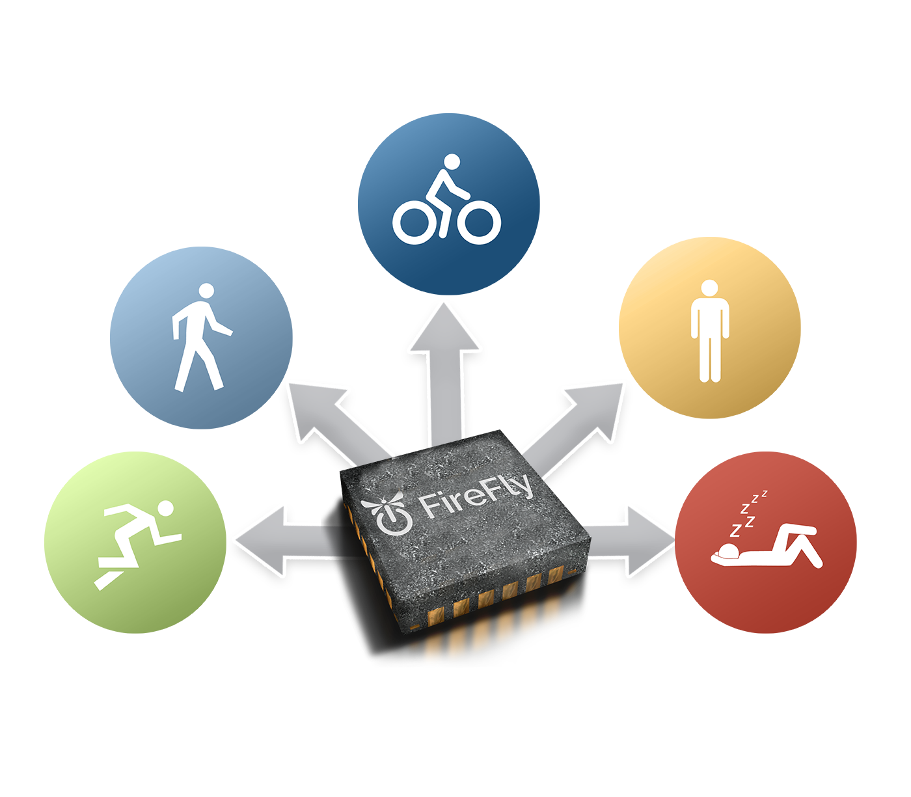
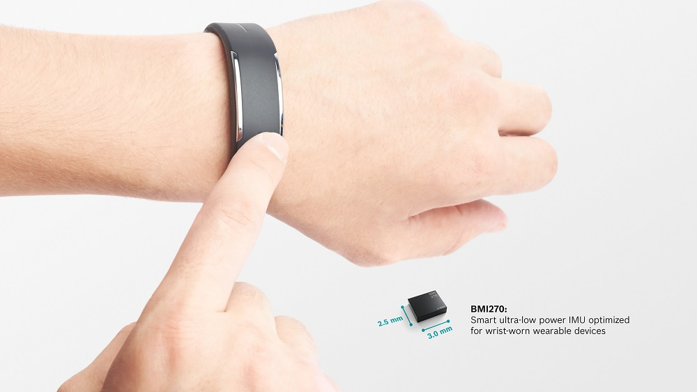

# Activity-Detection-using-IMU-sensor

User activity detection using IMU (Inertial Measurement Unit) sensors and power of deep learning. The accelerometer data from smart wearables is used for continuous activity detection, which can be used for in depth activity monitoring and recommender systems.

The data set that I am using is a collection of accelerometer data taken from a smartphone that various people carried with them while conducting six different exercises (Downstairs, Jogging, Sitting, Standing, Upstairs, Walking). For each exercise the acceleration for the x, y, and z axis was measured and captured with a timestamp and person ID.

With this available data, we would like to train a neural network in order to understand if a person carrying a smartphone is performing any of the six activities. Once the neural network has been trained on the existing data, it should be able to correctly predict the type of activity a person is conducting when given previously unseen data.

Based on the available data the DL model will learn how to differentiate between each of the six activities. We can then show new data to the neural network and it will tell us what the user is doing at any particular point in time.

